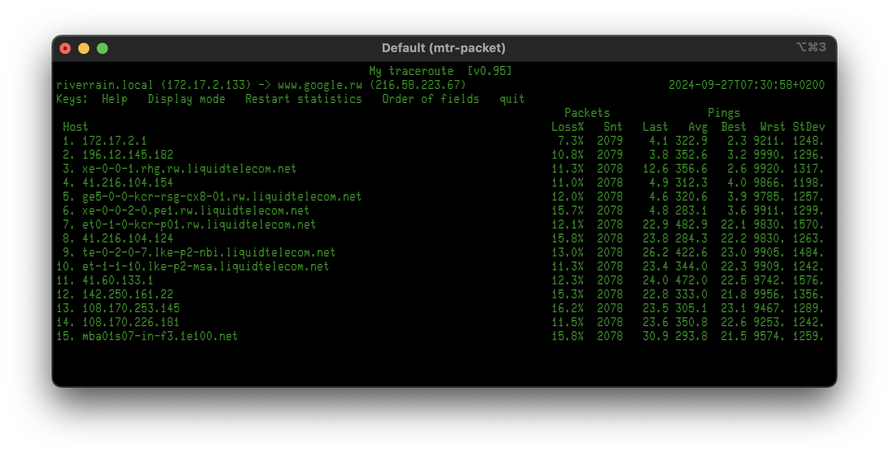
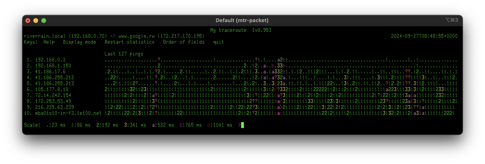
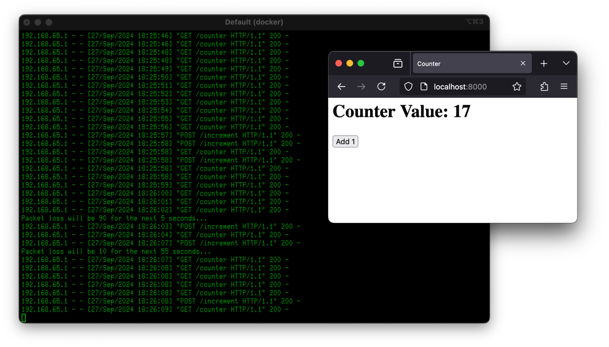

# Simulating Rwanda Network Conditions using Docker.

Being in Rwanda helps me understand the local network situation better, and I thought it would be nice to share that. I am in Muhanga (Rwanda) by invitation of CPF Ineza, as a volunteer expert from PUM. I am here to perform a cybersecurity audit that will CPF Ineza take the next step.

The people in Rwanda are well aware of how networks work and the infrastructure is set up nicely. I see fibre, bean radio connection and literally on every street corner there is a tiny kiosk selling 4G data bundles. That said, it is hard to have an interruption-free video meeting. Running software here, such as the RAG chatbot I am working on, shows bugs that would never show up under stable network conditions.

Tracing some of the networks shows a lot of packet loss in general, sometimes as high as 10% over half an hour, with wild fluctuations. It all gives the impression of an infrastructure that is is handling more traffic than it was designed for. Most wireless access points I see are of the suspiciously cheap kind, so that does not help. They have also been placed based on the wiring available, with no regard to walls or other obstructions that hinder radio signals.

The image below shows a screenshot from an [`mtr`](https://github.com/traviscross/mtr) trace that I ran from my hotel room this morning. The values shown were averaged over about 40 minutes. In that screenshot you can see the wireless network, the first hop from my machine to 171.17.2.1, lose about 7% of the traffic in that timeframe. A further 3%-8% is lost in the hops after that, with some variations. This pattern seems pretty consistent.

<p align="center" width="100%">
    
</p>

Interestingly, when things do work they are generally quite fast. There seems to be ample bandwidth _when_ things work. This suggests that perhaps packet routing and queueing is being overloaded, not so much the raw throughput.

This raises the question: how can we simulate these network circumstances locally, where we have reliable and fast connections. When I run a full web application on my development machine, there is not even a network that can fail. There is only the Docker container with the backend application.

Lucky for us, a person under the pseudonym contractdesign has this gem in their tech notes: [Emulating Realistic Network Conditions with tc in Docker](https://contractdesign.github.io/2019/11/03/tc.html). That is an excellent little tutorial and your are probably good if you just click the link and follow their instructions. But let’s see how we can make things a little more realistic.

What I see in the real world is that the packet loss is bursty. It is good for a while and then it is problematic for short while and then bad again. This can be seen in this second trace. If we are going to simulate the real world, let's make it one step more real.

<p align="center" width="100%">
    
</p>

I've made a script that simulates this by alternating between 10% and 90% packet loss. By editing the script, you can vary the loss percentages and durations. This repo includes a small client-server app that you can use to experiment with packet loss. Of cource, the idea is that you can copy the relevant parts of this script into your own code for testing.

After cloning the repository, you can build and run as follows and pointing a web browser at http://localhost:8000/.

```shell
$ docker build -t run_with_packet_loss .
$ docker run -p 8000:8000 --cap-add NET_ADMIN -it run_with_packet_loss
```

I find it quite entertaining to play with the timing and errors. Browser error recovery is actually pretty good, I must say, but I guess that should not come as a suprise.

<p align="center" width="100%">
    
</p>

Hope this helps.
